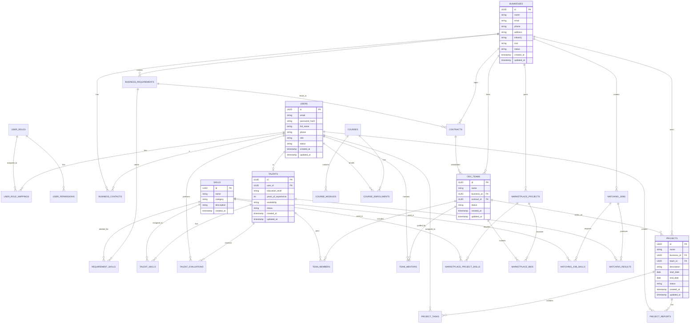

# Database Schema cho Lab-based ODC Platform

## 1. Tổng quan

Dựa trên phân tích các main flows và kiến trúc hệ thống, database schema được thiết kế để hỗ trợ nền tảng Lab-based ODC với các thành phần chính sau:

- Quản lý người dùng và phân quyền
- Quản lý Talent Pool và kỹ năng
- Quản lý doanh nghiệp và yêu cầu
- Quản lý ODC Team và dự án
- Hệ thống ghép nối dựa trên kỹ năng
- Marketplace cho các dự án mini
- Nền tảng học tập tương tác

## 2. Lựa chọn cơ sở dữ liệu

### PostgreSQL
Dùng cho dữ liệu quan hệ, cần tính toàn vẹn cao:
- Thông tin người dùng và phân quyền
- Thông tin doanh nghiệp và hợp đồng
- Quản lý dự án và ODC Team
- Quản lý tài chính và thanh toán

### MongoDB
Dùng cho dữ liệu phi cấu trúc hoặc cần linh hoạt:
- Hồ sơ cá nhân của Talent
- Feedback và đánh giá
- Log hệ thống
- Nội dung khóa học và tài liệu học tập

### Elasticsearch
Dùng cho các chức năng tìm kiếm toàn văn và phân tích dữ liệu:
- Tìm kiếm tài năng theo kỹ năng
- Tìm kiếm dự án và khóa học
- Phân tích dữ liệu và báo cáo

## 3. Database Schema (PostgreSQL)

### Users Schema

```sql
CREATE TABLE users (
    id UUID PRIMARY KEY DEFAULT gen_random_uuid(),
    email VARCHAR(255) NOT NULL UNIQUE,
    password_hash VARCHAR(255) NOT NULL,
    full_name VARCHAR(255) NOT NULL,
    phone VARCHAR(20),
    role VARCHAR(50) NOT NULL,
    status VARCHAR(20) NOT NULL DEFAULT 'active',
    created_at TIMESTAMP NOT NULL DEFAULT CURRENT_TIMESTAMP,
    updated_at TIMESTAMP NOT NULL DEFAULT CURRENT_TIMESTAMP
);

CREATE TABLE user_roles (
    id UUID PRIMARY KEY DEFAULT gen_random_uuid(),
    name VARCHAR(50) NOT NULL UNIQUE,
    description TEXT,
    created_at TIMESTAMP NOT NULL DEFAULT CURRENT_TIMESTAMP,
    updated_at TIMESTAMP NOT NULL DEFAULT CURRENT_TIMESTAMP
);

CREATE TABLE user_permissions (
    id UUID PRIMARY KEY DEFAULT gen_random_uuid(),
    role_id UUID NOT NULL REFERENCES user_roles(id),
    permission VARCHAR(100) NOT NULL,
    created_at TIMESTAMP NOT NULL DEFAULT CURRENT_TIMESTAMP,
    UNIQUE(role_id, permission)
);

CREATE TABLE user_role_mappings (
    id UUID PRIMARY KEY DEFAULT gen_random_uuid(),
    user_id UUID NOT NULL REFERENCES users(id),
    role_id UUID NOT NULL REFERENCES user_roles(id),
    created_at TIMESTAMP NOT NULL DEFAULT CURRENT_TIMESTAMP,
    UNIQUE(user_id, role_id)
);
```

### Businesses Schema

```sql
CREATE TABLE businesses (
    id UUID PRIMARY KEY DEFAULT gen_random_uuid(),
    name VARCHAR(255) NOT NULL,
    email VARCHAR(255) NOT NULL,
    phone VARCHAR(20) NOT NULL,
    address TEXT,
    industry VARCHAR(100),
    size VARCHAR(50),
    status VARCHAR(20) NOT NULL DEFAULT 'active',
    created_at TIMESTAMP NOT NULL DEFAULT CURRENT_TIMESTAMP,
    updated_at TIMESTAMP NOT NULL DEFAULT CURRENT_TIMESTAMP
);

CREATE TABLE business_contacts (
    id UUID PRIMARY KEY DEFAULT gen_random_uuid(),
    business_id UUID NOT NULL REFERENCES businesses(id),
    user_id UUID NOT NULL REFERENCES users(id),
    position VARCHAR(100),
    is_primary BOOLEAN NOT NULL DEFAULT false,
    created_at TIMESTAMP NOT NULL DEFAULT CURRENT_TIMESTAMP,
    updated_at TIMESTAMP NOT NULL DEFAULT CURRENT_TIMESTAMP
);

CREATE TABLE business_requirements (
    id UUID PRIMARY KEY DEFAULT gen_random_uuid(),
    business_id UUID NOT NULL REFERENCES businesses(id),
    title VARCHAR(255) NOT NULL,
    description TEXT,
    team_size INT,
    duration VARCHAR(50),
    contract_type VARCHAR(50),
    status VARCHAR(20) NOT NULL DEFAULT 'pending',
    created_at TIMESTAMP NOT NULL DEFAULT CURRENT_TIMESTAMP,
    updated_at TIMESTAMP NOT NULL DEFAULT CURRENT_TIMESTAMP
);

CREATE TABLE requirement_skills (
    id UUID PRIMARY KEY DEFAULT gen_random_uuid(),
    requirement_id UUID NOT NULL REFERENCES business_requirements(id),
    skill_id UUID NOT NULL REFERENCES skills(id),
    experience_level VARCHAR(50),
    created_at TIMESTAMP NOT NULL DEFAULT CURRENT_TIMESTAMP
);

CREATE TABLE contracts (
    id UUID PRIMARY KEY DEFAULT gen_random_uuid(),
    business_id UUID NOT NULL REFERENCES businesses(id),
    requirement_id UUID REFERENCES business_requirements(id),
    title VARCHAR(255) NOT NULL,
    description TEXT,
    start_date DATE NOT NULL,
    end_date DATE,
    contract_type VARCHAR(50) NOT NULL,
    status VARCHAR(20) NOT NULL DEFAULT 'draft',
    file_path VARCHAR(255),
    created_at TIMESTAMP NOT NULL DEFAULT CURRENT_TIMESTAMP,
    updated_at TIMESTAMP NOT NULL DEFAULT CURRENT_TIMESTAMP
);
```

### Talents Schema

```sql
CREATE TABLE talents (
    id UUID PRIMARY KEY DEFAULT gen_random_uuid(),
    user_id UUID NOT NULL REFERENCES users(id),
    education_level VARCHAR(100),
    years_of_experience INT,
    availability VARCHAR(50) NOT NULL DEFAULT 'available',
    status VARCHAR(20) NOT NULL DEFAULT 'active',
    created_at TIMESTAMP NOT NULL DEFAULT CURRENT_TIMESTAMP,
    updated_at TIMESTAMP NOT NULL DEFAULT CURRENT_TIMESTAMP
);

CREATE TABLE skills (
    id UUID PRIMARY KEY DEFAULT gen_random_uuid(),
    name VARCHAR(100) NOT NULL UNIQUE,
    category VARCHAR(50) NOT NULL,
    description TEXT,
    created_at TIMESTAMP NOT NULL DEFAULT CURRENT_TIMESTAMP
);

CREATE TABLE talent_skills (
    id UUID PRIMARY KEY DEFAULT gen_random_uuid(),
    talent_id UUID NOT NULL REFERENCES talents(id),
    skill_id UUID NOT NULL REFERENCES skills(id),
    proficiency_level INT NOT NULL,
    years_of_experience DECIMAL(4,1),
    verified BOOLEAN NOT NULL DEFAULT false,
    created_at TIMESTAMP NOT NULL DEFAULT CURRENT_TIMESTAMP,
    updated_at TIMESTAMP NOT NULL DEFAULT CURRENT_TIMESTAMP,
    UNIQUE(talent_id, skill_id)
);

CREATE TABLE talent_evaluations (
    id UUID PRIMARY KEY DEFAULT gen_random_uuid(),
    talent_id UUID NOT NULL REFERENCES talents(id),
    evaluator_id UUID NOT NULL REFERENCES users(id),
    evaluation_date DATE NOT NULL,
    overall_score DECIMAL(3,1) NOT NULL,
    comments TEXT,
    created_at TIMESTAMP NOT NULL DEFAULT CURRENT_TIMESTAMP
);
```

### ODC Teams Schema

```sql
CREATE TABLE odc_teams (
    id UUID PRIMARY KEY DEFAULT gen_random_uuid(),
    name VARCHAR(100) NOT NULL,
    business_id UUID NOT NULL REFERENCES businesses(id),
    contract_id UUID REFERENCES contracts(id),
    status VARCHAR(20) NOT NULL DEFAULT 'active',
    created_at TIMESTAMP NOT NULL DEFAULT CURRENT_TIMESTAMP,
    updated_at TIMESTAMP NOT NULL DEFAULT CURRENT_TIMESTAMP
);

CREATE TABLE team_members (
    id UUID PRIMARY KEY DEFAULT gen_random_uuid(),
    team_id UUID NOT NULL REFERENCES odc_teams(id),
    talent_id UUID NOT NULL REFERENCES talents(id),
    role VARCHAR(50) NOT NULL,
    join_date DATE NOT NULL,
    end_date DATE,
    status VARCHAR(20) NOT NULL DEFAULT 'active',
    created_at TIMESTAMP NOT NULL DEFAULT CURRENT_TIMESTAMP,
    updated_at TIMESTAMP NOT NULL DEFAULT CURRENT_TIMESTAMP
);

CREATE TABLE team_mentors (
    id UUID PRIMARY KEY DEFAULT gen_random_uuid(),
    team_id UUID NOT NULL REFERENCES odc_teams(id),
    mentor_id UUID NOT NULL REFERENCES users(id),
    start_date DATE NOT NULL,
    end_date DATE,
    created_at TIMESTAMP NOT NULL DEFAULT CURRENT_TIMESTAMP,
    updated_at TIMESTAMP NOT NULL DEFAULT CURRENT_TIMESTAMP
);
```

### Projects Schema

```sql
CREATE TABLE projects (
    id UUID PRIMARY KEY DEFAULT gen_random_uuid(),
    name VARCHAR(255) NOT NULL,
    business_id UUID NOT NULL REFERENCES businesses(id),
    team_id UUID REFERENCES odc_teams(id),
    description TEXT,
    start_date DATE NOT NULL,
    end_date DATE,
    status VARCHAR(20) NOT NULL DEFAULT 'planning',
    created_at TIMESTAMP NOT NULL DEFAULT CURRENT_TIMESTAMP,
    updated_at TIMESTAMP NOT NULL DEFAULT CURRENT_TIMESTAMP
);

CREATE TABLE project_tasks (
    id UUID PRIMARY KEY DEFAULT gen_random_uuid(),
    project_id UUID NOT NULL REFERENCES projects(id),
    title VARCHAR(255) NOT NULL,
    description TEXT,
    assignee_id UUID REFERENCES users(id),
    start_date DATE,
    due_date DATE,
    status VARCHAR(20) NOT NULL DEFAULT 'todo',
    priority VARCHAR(20) NOT NULL DEFAULT 'medium',
    created_at TIMESTAMP NOT NULL DEFAULT CURRENT_TIMESTAMP,
    updated_at TIMESTAMP NOT NULL DEFAULT CURRENT_TIMESTAMP
);

CREATE TABLE project_reports (
    id UUID PRIMARY KEY DEFAULT gen_random_uuid(),
    project_id UUID NOT NULL REFERENCES projects(id),
    reporter_id UUID NOT NULL REFERENCES users(id),
    report_date DATE NOT NULL,
    content TEXT NOT NULL,
    status VARCHAR(20) NOT NULL DEFAULT 'submitted',
    created_at TIMESTAMP NOT NULL DEFAULT CURRENT_TIMESTAMP,
    updated_at TIMESTAMP NOT NULL DEFAULT CURRENT_TIMESTAMP
);
```

### Marketplace Schema

```sql
CREATE TABLE marketplace_projects (
    id UUID PRIMARY KEY DEFAULT gen_random_uuid(),
    business_id UUID NOT NULL REFERENCES businesses(id),
    title VARCHAR(255) NOT NULL,
    description TEXT NOT NULL,
    budget_min DECIMAL(10,2),
    budget_max DECIMAL(10,2),
    duration VARCHAR(50),
    status VARCHAR(20) NOT NULL DEFAULT 'open',
    created_at TIMESTAMP NOT NULL DEFAULT CURRENT_TIMESTAMP,
    updated_at TIMESTAMP NOT NULL DEFAULT CURRENT_TIMESTAMP
);

CREATE TABLE marketplace_project_skills (
    id UUID PRIMARY KEY DEFAULT gen_random_uuid(),
    project_id UUID NOT NULL REFERENCES marketplace_projects(id),
    skill_id UUID NOT NULL REFERENCES skills(id),
    created_at TIMESTAMP NOT NULL DEFAULT CURRENT_TIMESTAMP
);

CREATE TABLE marketplace_bids (
    id UUID PRIMARY KEY DEFAULT gen_random_uuid(),
    project_id UUID NOT NULL REFERENCES marketplace_projects(id),
    team_id UUID NOT NULL REFERENCES odc_teams(id),
    proposal TEXT NOT NULL,
    price DECIMAL(10,2) NOT NULL,
    duration VARCHAR(50) NOT NULL,
    status VARCHAR(20) NOT NULL DEFAULT 'pending',
    created_at TIMESTAMP NOT NULL DEFAULT CURRENT_TIMESTAMP,
    updated_at TIMESTAMP NOT NULL DEFAULT CURRENT_TIMESTAMP
);
```

### Learning Platform Schema

```sql
CREATE TABLE courses (
    id UUID PRIMARY KEY DEFAULT gen_random_uuid(),
    title VARCHAR(255) NOT NULL,
    description TEXT,
    level VARCHAR(50) NOT NULL,
    duration INT,
    status VARCHAR(20) NOT NULL DEFAULT 'draft',
    created_at TIMESTAMP NOT NULL DEFAULT CURRENT_TIMESTAMP,
    updated_at TIMESTAMP NOT NULL DEFAULT CURRENT_TIMESTAMP
);

CREATE TABLE course_modules (
    id UUID PRIMARY KEY DEFAULT gen_random_uuid(),
    course_id UUID NOT NULL REFERENCES courses(id),
    title VARCHAR(255) NOT NULL,
    description TEXT,
    sequence_order INT NOT NULL,
    created_at TIMESTAMP NOT NULL DEFAULT CURRENT_TIMESTAMP,
    updated_at TIMESTAMP NOT NULL DEFAULT CURRENT_TIMESTAMP
);

CREATE TABLE course_enrollments (
    id UUID PRIMARY KEY DEFAULT gen_random_uuid(),
    course_id UUID NOT NULL REFERENCES courses(id),
    user_id UUID NOT NULL REFERENCES users(id),
    enrollment_date DATE NOT NULL,
    completion_date DATE,
    status VARCHAR(20) NOT NULL DEFAULT 'enrolled',
    created_at TIMESTAMP NOT NULL DEFAULT CURRENT_TIMESTAMP,
    updated_at TIMESTAMP NOT NULL DEFAULT CURRENT_TIMESTAMP,
    UNIQUE(course_id, user_id)
);
```

### Skill Matching Schema

```sql
CREATE TABLE matching_jobs (
    id UUID PRIMARY KEY DEFAULT gen_random_uuid(),
    business_id UUID NOT NULL REFERENCES businesses(id),
    title VARCHAR(255) NOT NULL,
    description TEXT,
    team_size INT NOT NULL,
    duration VARCHAR(50),
    status VARCHAR(20) NOT NULL DEFAULT 'open',
    created_at TIMESTAMP NOT NULL DEFAULT CURRENT_TIMESTAMP,
    updated_at TIMESTAMP NOT NULL DEFAULT CURRENT_TIMESTAMP
);

CREATE TABLE matching_job_skills (
    id UUID PRIMARY KEY DEFAULT gen_random_uuid(),
    job_id UUID NOT NULL REFERENCES matching_jobs(id),
    skill_id UUID NOT NULL REFERENCES skills(id),
    importance INT NOT NULL DEFAULT 1,
    min_proficiency INT,
    created_at TIMESTAMP NOT NULL DEFAULT CURRENT_TIMESTAMP
);

CREATE TABLE matching_results (
    id UUID PRIMARY KEY DEFAULT gen_random_uuid(),
    job_id UUID NOT NULL REFERENCES matching_jobs(id),
    talent_id UUID NOT NULL REFERENCES talents(id),
    match_score DECIMAL(5,2) NOT NULL,
    status VARCHAR(20) NOT NULL DEFAULT 'pending',
    created_at TIMESTAMP NOT NULL DEFAULT CURRENT_TIMESTAMP,
    updated_at TIMESTAMP NOT NULL DEFAULT CURRENT_TIMESTAMP
);
```

## 4. MongoDB Collections

### Talent Profiles Collection
```json
{
  "_id": "ObjectId",
  "talent_id": "UUID",
  "personal_info": {
    "bio": "string",
    "interests": ["string"],
    "preferred_work_environment": "string",
    "career_goals": "string"
  },
  "education": [
    {
      "institution": "string",
      "degree": "string",
      "field": "string",
      "start_date": "date",
      "end_date": "date",
      "description": "string"
    }
  ],
  "work_experience": [
    {
      "company": "string",
      "position": "string",
      "start_date": "date",
      "end_date": "date",
      "description": "string",
      "technologies": ["string"]
    }
  ],
  "projects": [
    {
      "name": "string",
      "description": "string",
      "role": "string",
      "technologies": ["string"],
      "url": "string"
    }
  ],
  "certifications": [
    {
      "name": "string",
      "issuer": "string",
      "date": "date",
      "expires": "date",
      "url": "string"
    }
  ],
  "social_links": {
    "linkedin": "string",
    "github": "string",
    "portfolio": "string"
  },
  "created_at": "date",
  "updated_at": "date"
}
```

### Feedback Collection
```json
{
  "_id": "ObjectId",
  "entity_type": "string",
  "entity_id": "UUID",
  "user_id": "UUID",
  "rating": "number",
  "content": "string",
  "attributes": {
    "communication": "number",
    "quality": "number",
    "timeliness": "number",
    "expertise": "number"
  },
  "created_at": "date"
}
```

### Course Content Collection
```json
{
  "_id": "ObjectId",
  "course_id": "UUID",
  "module_id": "UUID",
  "type": "string",
  "title": "string",
  "content": "string",
  "media": [
    {
      "type": "string",
      "url": "string",
      "description": "string"
    }
  ],
  "attachments": [
    {
      "name": "string",
      "url": "string",
      "size": "number"
    }
  ],
  "sequence_order": "number",
  "estimated_time": "number",
  "created_at": "date",
  "updated_at": "date"
}
```

### System Logs Collection
```json
{
  "_id": "ObjectId",
  "timestamp": "date",
  "level": "string",
  "service": "string",
  "message": "string",
  "user_id": "UUID",
  "ip_address": "string",
  "request_path": "string",
  "request_method": "string",
  "status_code": "number",
  "execution_time": "number",
  "additional_data": "object"
}
```

## 5. Elasticsearch Indices

### Talent Search Index
```json
{
  "mappings": {
    "properties": {
      "talent_id": { "type": "keyword" },
      "full_name": { "type": "text" },
      "skills": {
        "type": "nested",
        "properties": {
          "skill_id": { "type": "keyword" },
          "name": { "type": "text" },
          "category": { "type": "keyword" },
          "proficiency": { "type": "integer" },
          "years": { "type": "float" }
        }
      },
      "education_level": { "type": "keyword" },
      "years_of_experience": { "type": "integer" },
      "availability": { "type": "keyword" },
      "projects": {
        "type": "nested",
        "properties": {
          "name": { "type": "text" },
          "technologies": { "type": "text" }
        }
      },
      "location": { "type": "geo_point" }
    }
  }
}
```

### Course Search Index
```json
{
  "mappings": {
    "properties": {
      "course_id": { "type": "keyword" },
      "title": { "type": "text" },
      "description": { "type": "text" },
      "level": { "type": "keyword" },
      "skills": { "type": "keyword" },
      "content": { "type": "text" },
      "tags": { "type": "keyword" },
      "rating": { "type": "float" },
      "enrollment_count": { "type": "integer" }
    }
  }
}
```

## 6. Sơ đồ ERD



## 7. Kết luận

Database schema được thiết kế để hỗ trợ đầy đủ các chức năng của nền tảng Lab-based ODC, với việc sử dụng UUID làm primary key cho tất cả các bảng để đảm bảo tính duy nhất và bảo mật. Việc phân chia dữ liệu vào các loại cơ sở dữ liệu khác nhau (PostgreSQL, MongoDB, Elasticsearch) giúp tối ưu hóa hiệu suất và khả năng mở rộng của hệ thống.

Schema này hỗ trợ đầy đủ các main flows đã được xác định, bao gồm onboarding doanh nghiệp, quản lý Talent Pool, thành lập và vận hành ODC Team, quản lý dự án, skill matching, marketplace cho mini-projects và nền tảng học tập tương tác.

Các mối quan hệ giữa các bảng được thiết kế để đảm bảo tính toàn vẹn dữ liệu và hỗ trợ các truy vấn phức tạp. Các chỉ mục được tạo cho các cột thường xuyên được sử dụng trong các truy vấn để tối ưu hóa hiệu suất.
        